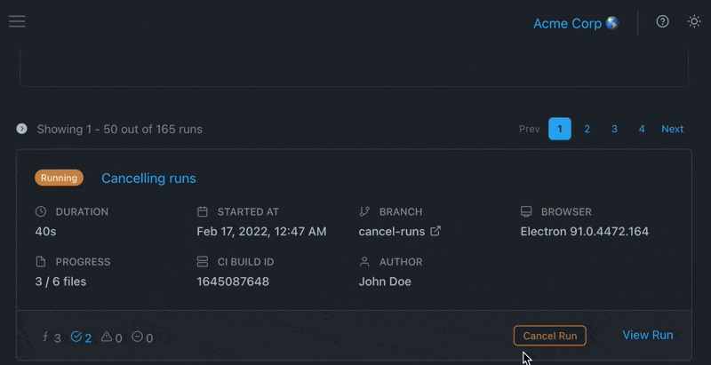
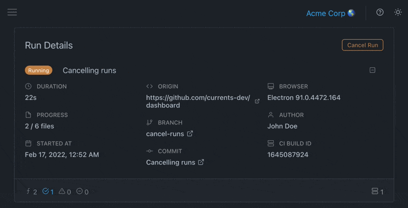

# Cancel Run

You can stop cypress test by cancelling runs that are currently in progress using dashboard controls.&#x20;

Cancelling a run can be useful for:

* preventing run from timing out
* optimizing usage of your CI provider resources
* reducing the number of recorded tests


Please note: Cancelling a run cannot be undone


### How to cancel Cypress tests run?

In-progress runs can be cancelled by clicking "Cancel Run" button in Runs Feed view.

You can also cancel a run when from Run Details view.

### What happens when a run is cancelled?

Cancelling a run affects in-progress and pending tests, as well as integrations and runs analytics.

* the run's status will become "Cancelled"
* in-progress tests will run to completion, the dashboard will accept their result
* attempts to start a new test for a cancelled run would fail with the error message `Run is cancelled`

### How cancelled runs affect insights?

* Cancelled runs are excluded from Runs Insights - only completed runs appear in Runs Insights charts
* Tests recorded as part of a cancelled run are still included in Tests Insights charts

### How does cancelling a run affect test records plan usage?

* Only fully recorded tests consume your organization's test records limit.&#x20;
* Cancelled runs do consume your organization's runs limit (for organizations on deprecated runs-based plans)

### How does cancelling a run affect integrations (GitHub, Slack, etc.)?

#### GitHub / BitBucket Commit Status Check

* Commit status checks will display `Cancelled by <username>` message
* Commit status check outcome will be set according to the last known run status, for example
  * if no failed tests were recorded before the cancellation, status check outcome will be `success`
  * otherwise status check outcome will be `failure`

#### GitHub PR Comment

* Currents will post a new PR comment with `Cancelled by <username>` message
* PR comment details will be set according to the last known run status

#### Slack / MS Teams

* Currents will post a cancellation notification with the last known run results

.png>)

#### HTTP Webhook Integration

* A new HTTP POST request will be emitted with  last known run results. and event type `RUN_CANCELED`  See [http-webhooks.md](../integrations/http-webhooks.md "mention") for details.

