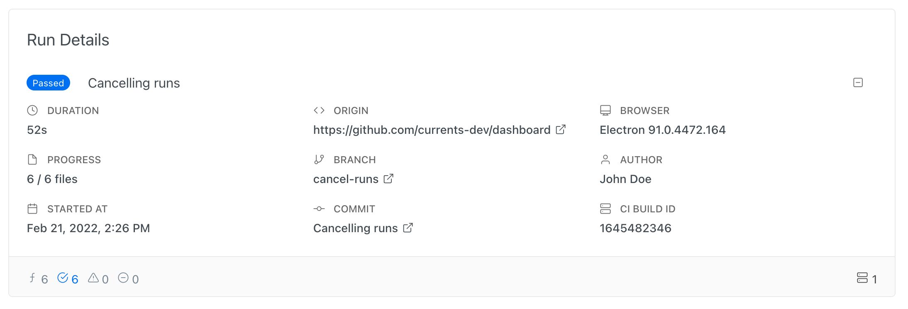

# Run Details

When creating a new run, cypress agents collect various information about their environment - this information is shown as Run Details in Currents Dashboard.



| Field       | Description                                                          |
| ----------- | -------------------------------------------------------------------- |
| Duration    | Run's duration                                                       |
| Progress    | Completed / overall spec files progress                              |
| Started at  | Run start timestamp                                                  |
| Origin      | GIt remote origin                                                    |
| Branch      | Git branch                                                           |
| Commit      | Git commit message                                                   |
| Browser     | Cypress tests browser                                                |
| Author      | Git commit author                                                    |
| CI Build ID | [cypress-ci-build-id.md](../guides/cypress-ci-build-id.md "mention") |

### Cypress Run Git Information

Internally, cypress uses [https://github.com/cypress-io/commit-info](https://github.com/cypress-io/commit-info) npm package for fetching git information.

In order to to obtain git data, `.git` folder should be available during execution of your cypress tests (on CI machines). The package uses Git commands to get each property, like `git show -s --pretty=%B`, see [src/git-api.js](https://github.com/cypress-io/commit-info/blob/master/src/git-api.js).&#x20;

When git information is not available from `.git` folder. you can provide fallback  environment variables:

```
COMMIT_INFO_BRANCH: branch
COMMIT_INFO_MESSAGE: commit message
COMMIT_INFO_EMAIL: commit author email
COMMIT_INFO_AUTHOR: commit author name
COMMIT_INFO_SHA: commit info sha
COMMIT_INFO_TIMESTAMP: commit timestamp
COMMIT_INFO_REMOTE: remote origin
```


**Please note:** If no git information is available - either from`.git` folder or from environment variables, no information or default placeholder data will be shown&#x20;



Please note: git information is required for Bitbucket, GitHub, Gitlab and other SVC providers

