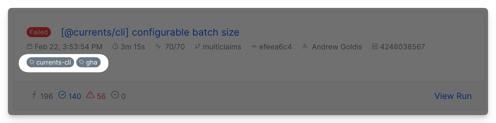
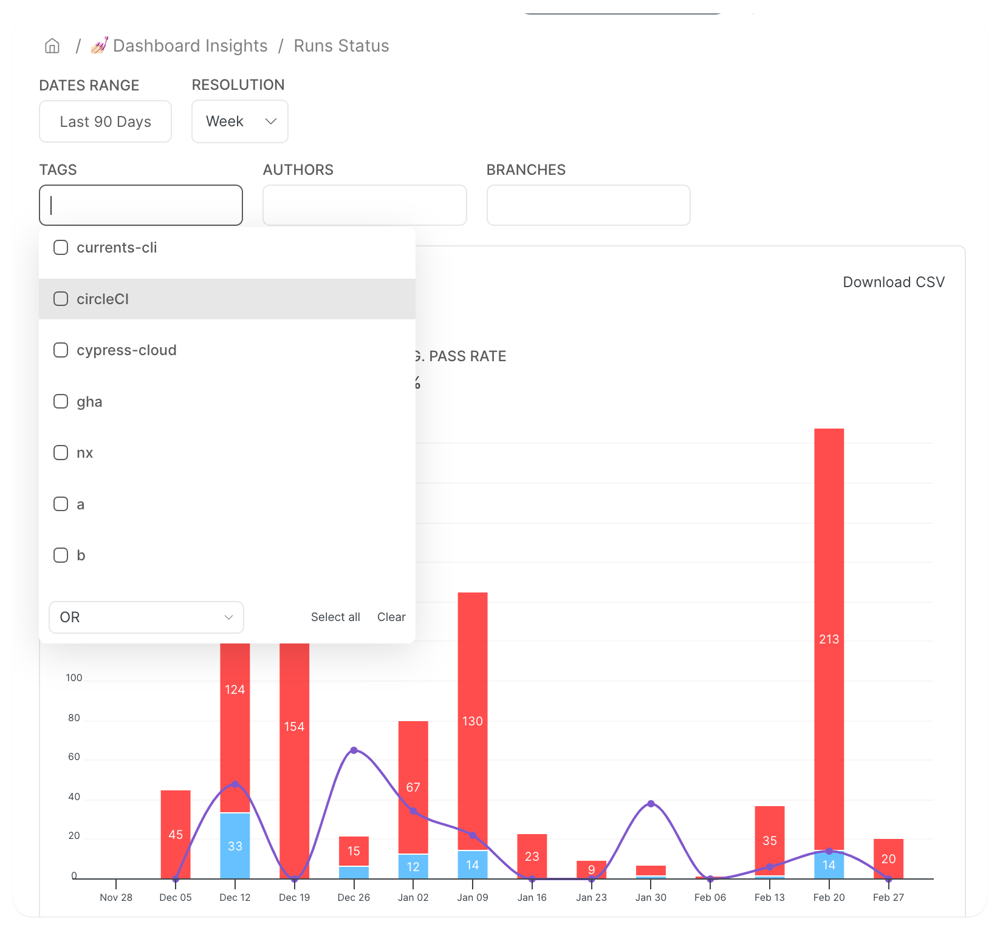

# Run Details

When creating a new run, playwright and cypress collect various information about the environment - this information is shown as Run Details in Currents Dashboard.

<figure><figcaption><p>Run details example</p></figcaption></figure>

| Field             | Description                                                                                                     |
| ----------------- | --------------------------------------------------------------------------------------------------------------- |
| Duration          | Run's duration                                                                                                  |
| Progress          | Completed / overall spec files progress                                                                         |
| Started at        | Run start timestamp                                                                                             |
| Branch            | Git branch (or HEAD branch name for [GitHub PRs](../ci-setup/github-actions/commit-data-for-github-actions.md)) |
| Commit            | Git commit message (or [PR Title GitHub PRs](../ci-setup/github-actions/commit-data-for-github-actions.md))     |
| Browser / Project | Cypress tests browser or Playwright Project                                                                     |
| Author            | Git commit author                                                                                               |
| CI Build ID       | [ci-build-id.md](../guides/ci-build-id.md "mention")                                                            |

### Playwright / Cypress Git Information

In order to obtain git data, `.git` directory should be available during the execution of your tests (on CI machines). The package uses Git commands to get each property, like `git show -s --pretty=%B`, see [src/git-api.js](https://github.com/cypress-io/commit-info/blob/master/src/git-api.js).&#x20;

In addition, we can detect git information from certain CI-specific environment variables (e.g. [GitHub Actions Default Environment Variables](https://docs.github.com/en/actions/learn-github-actions/variables#default-environment-variables)).&#x20;

When git information is not available from `.git` folder or environment variables, you can provide the data explicitly using environment variables:

```
COMMIT_INFO_BRANCH: branch
COMMIT_INFO_MESSAGE: commit message
COMMIT_INFO_EMAIL: commit author email
COMMIT_INFO_AUTHOR: commit author name
COMMIT_INFO_SHA: commit info sha
COMMIT_INFO_TIMESTAMP: commit timestamp
COMMIT_INFO_REMOTE: remote origin
```


**Please note:** If no git information is available - either from`.git` folder or from environment variables, no git data will be shown&#x20;

`git` information is required for Bitbucket, GitHub and GitLab integrations to work properly


If you're not seeing git information for your runs, most chances it is just not available in the CI environment. Please enable the debug mode for [Playwright](../integration-with-playwright/troubleshooting.md) or [Cypress](../integration-with-cypress/troubleshooting.md#cypress-cloud) or add [git commands](https://github.com/cypress-io/commit-info/blob/3edc0e3005873997a15204be7daf45666fb9b932/src/git-api.js#L10) to your CI workflow for troubleshooting.

Read more about detecting [Pull Requests in GitHub Actions](../ci-setup/github-actions/commit-data-for-github-actions.md).

### Run Tags

Tagging is a convenient way to augment your executions with extra data that can be helpful for managing your tests. You can tag the runs (executions) by adding `--tag tagA,tagB` flag to `currents` command.

For example, running the next command `@currents/playwright` (version 1.7.0+):


```
npx pwc --key RECORD_KEY --project-id PROJECT_ID --ci-build-id CI_BUILD_ID --tag currents-cli,gha
```


or for cypress:

```
cypress-cloud run --parallel --record --tag currents-cli,gha 
```


Would generate a run with the corresponding tags:

<figure><figcaption><p>Tagged run example</p></figcaption></figure>

The run, spec and test execution recordings will inherit the tags. You can use the tags as a filter when browsing the dashboard to narrow down the results, for example:

* filter runs by tags
* filter insights and analytics to only include records with a particular tag
* filter errors, tests and spec performance explorers to only include records with a particular tag

The tags are also available in the results returned from the [Broken link](broken-reference "mention") and as part of [http-webhooks.md](../integrations/http-webhooks.md "mention")

<figure><figcaption><p>Example of filterin Run Status Metrics by Tags</p></figcaption></figure>
