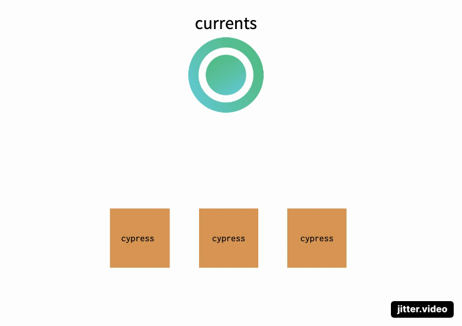
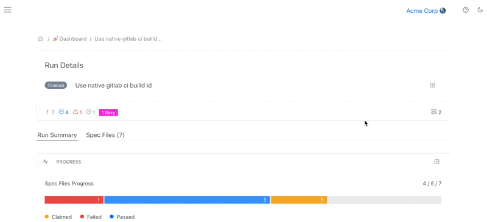

# Run Timeouts

### Why do cypress tests time out?

If any of your spec files takes too long to report the results back to Currents dashboard, the whole run is being marked as timed out. Why is that?

Unfortunately, sometimes containers crash or become unresponsive due to various reasons, for example:

* hardware failure
* software bugs
* preemptive termination (by user or OS)

Cypress agents do **not** send their status to Currents when shut down or terminated.

Therefore, the dashboard service cannot determine whether the lack of response is due to a crash, termination or long-running test.

If no response received from a container within a certain period of time, the whole run is marked as  timed out.

The default timeout value is 30 minutes.&#x20;

### How to change the default time out?

You can change the default timeout for each individual project in Project Settings. The minimum value is 3 minutes, the maximum value is 12 hours.&#x20;

The default timeout value is 30 minutes.&#x20;

.png>)

### How to avoid timeouts for cypress tests?

Try changing the default timeout settings for your projects, that's usually is sufficient. If you still experiencing timeouts there are a few additional options.

#### Reorganizing your cypress tests to avoid timeout

Try rearranging your tests so that every spec file has a lower number of tests, so that overall spec runtime is less than the timeout.

#### Avoid prolonged `cy.wait`&#x20;

Having a test that has many `cy.wait` waiting for considerable time can accumulate and increase overall runtime of your tests. Try reducing the amount of calls to `cy.wait` (which is, in general, a good practice) or reduce the values of your wait periods.

#### Improving runtime performance

Try using more powerful CI machines that can run your tests faster; tweak `cypress` [video settings](https://docs.cypress.io/guides/guides/screenshots-and-videos#Videos) to tune the load of generating and compressing video recordings of your tests.

#### Investigate and eliminate crashes

Examine you CI jobs log file and eliminate any crashes or instability that cause the containers to become non-responsive.

### How to identify spec files and machines that cause time outs?

#### Use Cypress Agents view to identify the timed out files

Open the Run Details view for a "timed out" run. Make sure that Run Summary tab is selected.

Explore the list of cypress agents and identify agents that are still in "Running" state (marked in <mark style="color:orange;">orange</mark>).

The spec file name that was never reported will appear next to "idle" cypress agent, hover the mouse cursor to see the details.

#### Use Spec List view to see idle spec files

Open the Run Details view for a "timed out" run. Make sure that Spec Files tab is selected.

Filter the list of spec files, make sure that only "Running" and "Idle" spec files are selected.

* Spec files in "running" state are likely to cause a time out
* If no spec file was sent for execution but no results received within 120 minutes, the spec file will be marked as "Idle"

### Runs timeouts FAQ

#### Why is my runs still in-progress after I stopped tests?

Cypress agent do not notify the dashboard when they are stopped or halted, that's why the dashboard can't detect their termination. If no results received for more than 30 minutes, the run will be marked as timed out. You can change the timeout value in project settings.

#### How can I  stop a run in dashboard?

You can cancel runs from the dashboard. See [cancel-run.md](cancel-run.md "mention") section.

#### CI shows that a run is successful, but it has timed out in dashboard, why?

The most common reason is prematurely terminating `cypress`/ `currents` process before letting it report all the results back to the dashboard.

If you're using a script / wrapper to run your cypress tests, please make sure that `cypress` / `currents` process finishes its execution completely.

#### I need help troubleshooting timedout runs!

Please use in-app support channel for assistance. Please make sure that all the spec files have successfully finished their execution on CI and reported the results back to the dashboard.

