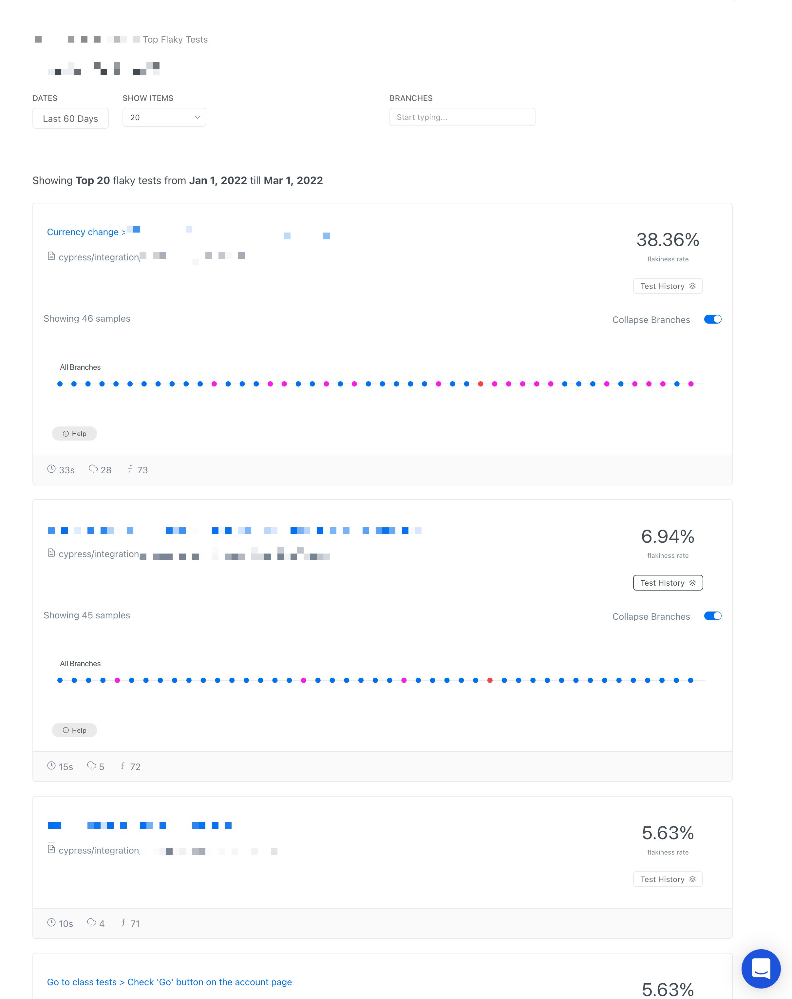

# Flaky Tests

### What is flaky cypress test?

Flaky cypress test is a tests that did not succeed from the first attempt. Flaky tests are marked with a special badge on run, spec and individual test level.

.png>)

### How to activate flaky tests detection?

Flaky tests are automatically activated for all cypress tests with [retries](https://docs.cypress.io/guides/guides/test-retries#How-It-Works) enabled. When a test has retries enabled and doesn't not pass from the first attempt, it will be marked as flaky.&#x20;

### Why are flaky tests bad?

Flaky tests are considered harmful because:

* You cannot trust them - neither system / component under test nor the test itself are reliable
* Even if flaky tests pass, your end users can experience intermittent issues
* Flaky tests increase the duration of your tests suite

### How to get rid of flaky tests?

* Examine the outcomes of your runs to see what tests are flaky and eliminate the source of flakiness.
* Use our Flaky Tests Insights to see the tests with highest flakiness rate

&#x20;
